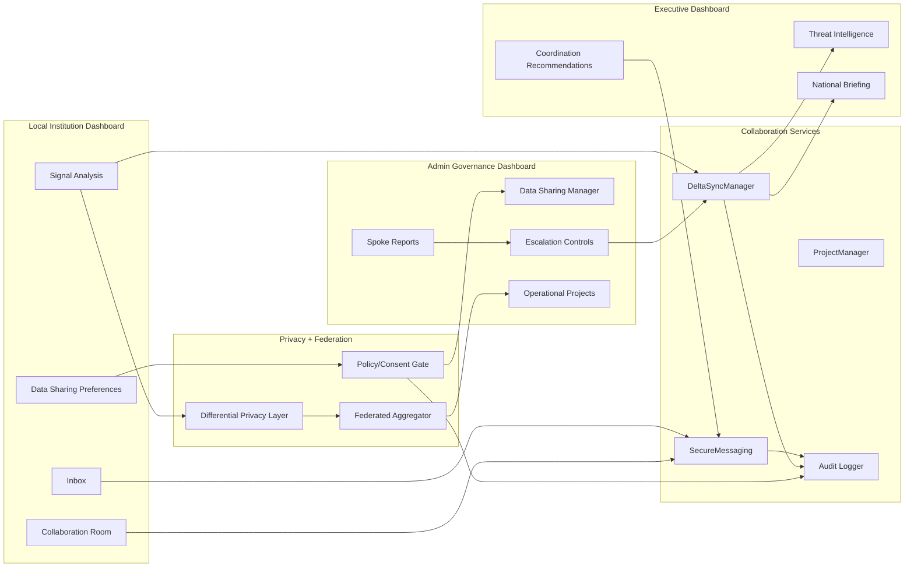
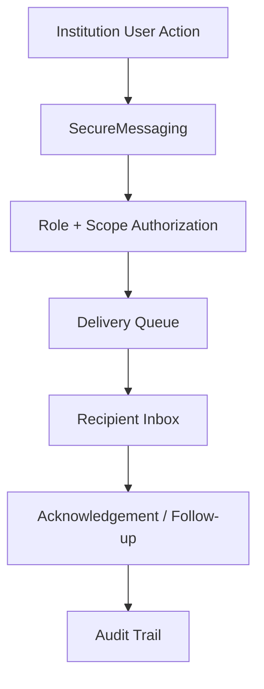
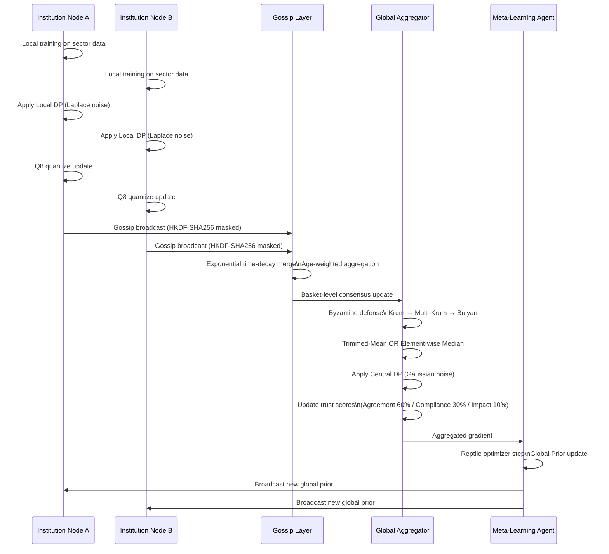
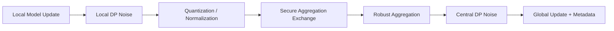
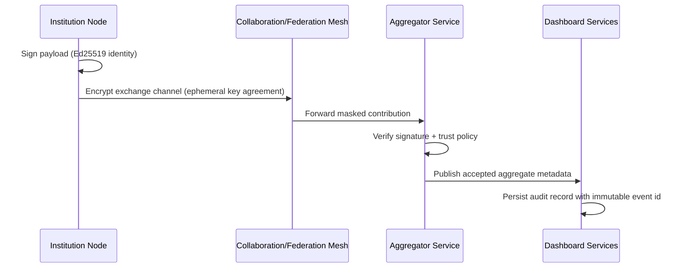
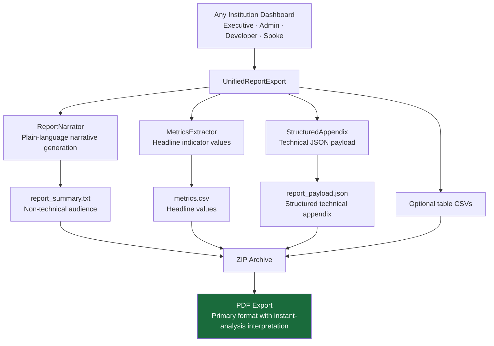

# KCollab — Aegis Federation & Secure Collaboration

KCollab is a collaborative platform that connects stakeholders—such as government agencies, businesses, and researchers—to coordinate responses and share insights via secure privacy-preserving protocols.

---

## 1. Collaboration, Data Sharing, Privacy, and Encryption Architecture

This section documents how institutions collaborate through the dashboard while preserving privacy, enforcing consent boundaries, and protecting data in transit and at rest.

### 1.1 Collaboration Design Goals

1. Enable cross-institution coordination without forcing raw data exposure.
2. Support role-specific visibility across Executive, Admin, and Local views.
3. Provide verifiable audit trails for every promotion, share, and action.
4. Preserve analytical utility while minimizing privacy leakage risk.
5. Enforce secure transport and cryptographic integrity end to end.

### 1.2 Collaboration Architecture (Dashboard + Backend)



### 1.3 Collaboration Room and Messaging Flow



Messaging design properties:

1. Role-scoped delivery prevents unauthorized cross-sector visibility.
2. Message lifecycle events are auditable.
3. Collaboration threads can be linked to projects and escalation events.

---

## 2. Aegis Federation Protocol



### 2.1 Differential Privacy Pipeline



---

## 3. Security Architecture & Encryption Model

```mermaid
flowchart TD
    subgraph Clearance["Security Lattice"]
        L4[TOP_SECRET]
        L3[SECRET]
        L2[RESTRICTED]
        L1[UNCLASSIFIED]
        L4 --> L3 --> L2 --> L1
    end

    subgraph Auth["Authentication Layers"]
        A1[Institution: PBKDF2-SHA256\n200,000 iterations]
        A2[Module Access: SHA256 gate codes]
        A3[Federation: Ed25519 signatures]
        A4[Pairwise: HKDF-SHA256 masking]
    end

    subgraph Privacy["Privacy Guarantees"]
        P1[Local DP: Laplace noise on weights]
        P2[Central DP: Gaussian noise on aggregate\nσ = sensitivity × √2ln(1.25/δ) / ε]
        P3[Q8 quantization: economic precision preserved]
        P4[L2 materiality check: suppress trivial updates]
    end

    subgraph Trust["Trust Scoring"]
        T1[Agreement score: 60% weight]
        T2[Compliance score: 30% weight]
        T3[Impact score: 10% weight]
        T1 & T2 & T3 --> T4{Trust < 0.2?}
        T4 -->|Yes| T5[Sandboxed: packets accepted\nbut silently discarded]
        T4 -->|No| T6[Normal aggregation]
    end
```

### 3.1 Encryption and Integrity Model



---

## 4. Report Export Pipeline


