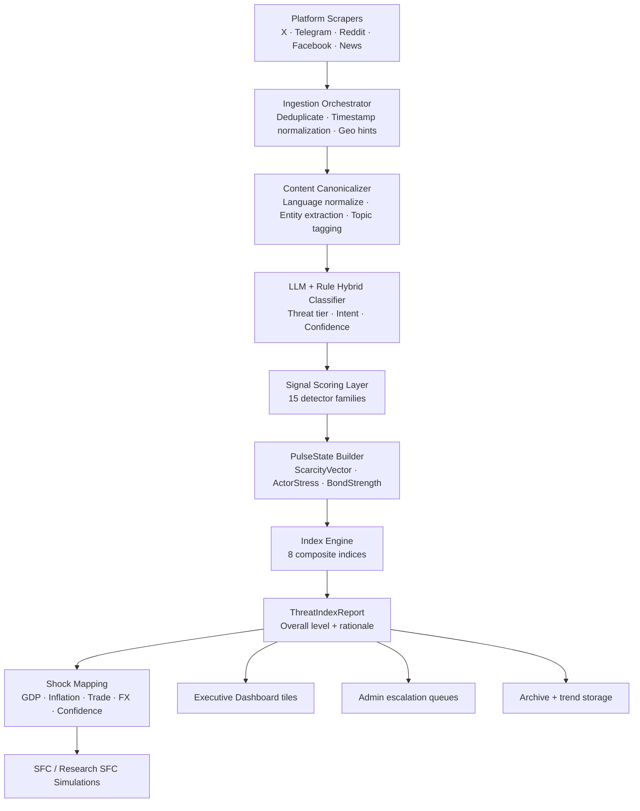
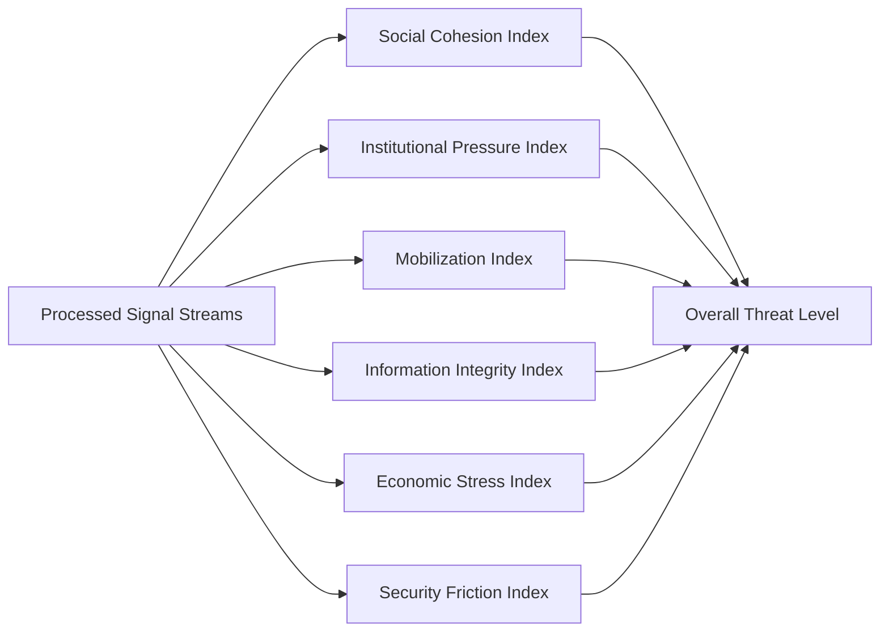
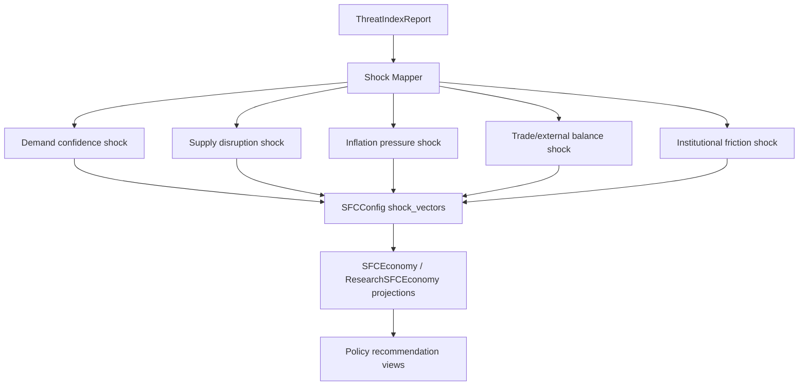

# Pulse Intelligence Architecture

Pulse Intelligence turns multi-source social, economic, and institutional signals into decision-support intelligence for public-sector and institutional teams.

## 1. End-to-End Pulse Computation Graph

## 2. Core Calculation Stages

### Stage A — Ingestion Quality Control
Each raw event is assigned a quality weight based on source reliability history, duplicate density, parsing completeness, and geo confidence. 

### Stage B — Detector Scoring (15 Families)
The detector layer transforms each normalized post into detector intensities:

1. **Distress family**: food/water/health stress markers.
2. **Anger and escalation family**: aggression, mobilization language, urgency verbs.
3. **Institutional legitimacy family**: governance rejection and trust erosion signals.
4. **Identity polarization family**: group-framing and exclusion language.
5. **Information warfare family**: rumor, contradiction, synthetic amplification patterns.

### Stage C — Temporal Smoothing and Burst Control
To avoid overreaction to one-off spikes, each detector stream is smoothed with exponentially weighted moving averages and burst clamps.

### Stage D — PulseState Assembly
PulseState is assembled from grouped detector vectors:

- **ScarcityVector** from distress, access, service-breakdown indicators.
- **ActorStress** from institutional conflict, mobilization, and pressure cues.
- **BondStrength** from trust and cohesion evidence (inverted for risk).

## 3. Threat Indices and Scoring

The platform computes 8 multiple domain indices and then synthesizes an overall threat level.

## 4. How Pulse Feeds the Simulation Layer

Pulse outputs are transformed into scenario-ready shock vectors for the downstream KShield simulation layers.

