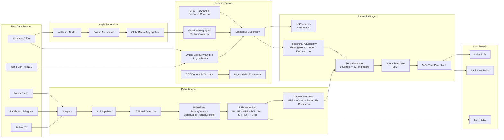
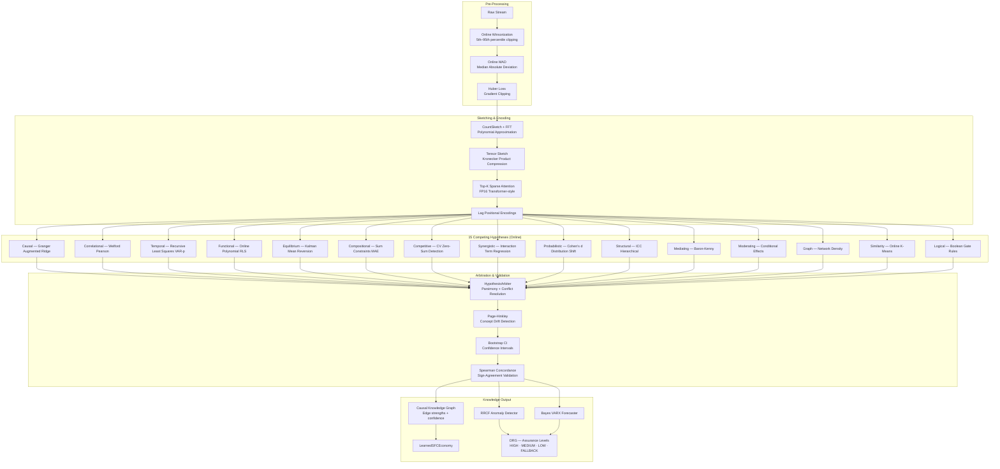
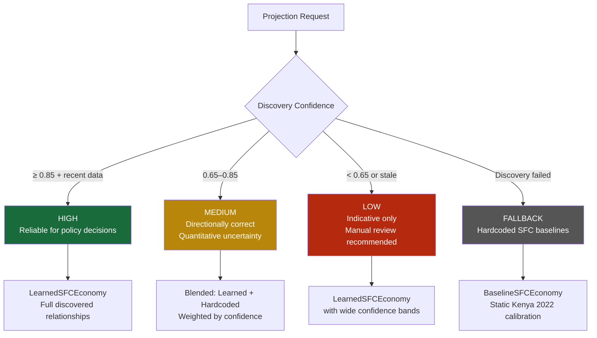

# KScarcity Unified Platform

KScarcity is a unified national-level platform that gives the government a real-time overview of policies, sectoral activities, and institutional operations. 

It analyzes data across sectoral, institutional, and national layers, trains machine learning models in real time, explains the five W's and one H, simulates risks and policy responses, and allows collaboration for planning and preparing for future shocks. Essentially, it integrates monitoring, analysis, and simulation tailored to a country's needs.

---

## 1. Full System Data Flow



---

## 2. Scarcity Engine — Online Learning Architecture



---

## 3. Institution Dashboard — Navigation Structure

```mermaid
flowchart TD
    L[Landing Page\n5 Ws — Who · What · When · Where · Why] --> A

    A[Institution Portal Login\nSector + Invite Code + Password] --> B{Role}

    B --> C[Executive Dashboard]
    B --> D[Admin Governance Console]
    B --> E[Developer Dashboard]
    B --> F[Local / Spoke Dashboard]

    C --> C1[National Briefing\nThreat Intelligence · Social Signals]
    C --> C2[Sector Reports\n7 Sectors — status grid always visible]
    C --> C3[Command & Control\nActive Operations]
    C --> C4[Policy Simulator\nScenario design + projections]
    C --> C5[Collaboration Room\nCross-institution messaging]
    C --> C6[Archive\nHistorical reports]
    C --> C7[Analytics Pillars\nSO WHAT · COMPARED TO WHAT · WHERE EXACTLY\nWHAT SHOULD I DO · DID IT WORK]

    D --> D1[Pending Approvals\nInstitution registration review]
    D --> D2[Audit Logs\nFull approval audit trail]
    D --> D3[Topology Injection\nLevel 1/2 agency hierarchy]
    D --> D4[FL Dashboard\nFederated learning round management]
    D --> D5[Admin Data Schemas\nStructured project tracking]

    E --> E1[Model Quality\nDRG assurance levels]
    E --> E2[Causal Adapter\nDiscovery engine inspection]
    E --> E3[Technical Metrics\nLatency · throughput · hypothesis counts]

    F --> F1[County Analytics\nLocalized indicators]
    F --> F2[Cost of Delay\nKES billions — Do Nothing · Act Early · Price of Late]
    F --> F3[Data Upload\nCSV → FL training trigger]
    F --> F4[Report Export\nPDF · ZIP · CSV]
```



---

## 4. DRG Assurance Levels



---

## 5. Component Interaction Map (Low-Level)

```
scarcity/engine/
┌──────────────────────────────────────────────────────────────────────┐
│  EventBus (runtime/bus.py)  — async pub/sub backbone                 │
│   "data_window"                ← new data row arrives                │
│   "scarcity.anomaly_detected"  → RRCF result                         │
│   "scarcity.forecasted_trends" → Bayes VARX result                   │
│   "scarcity.drg_extension_profile" → DRG risk profile                │
│                                                                      │
│  OnlineAnomalyDetector  (RRCF — streaming, no training phase)        │
│   Output: {anomaly_score: float, is_anomaly: bool, context: dict}    │
│                                                                      │
│  PredictiveForecaster  (GARCH-VARX — multi-variate + exogenous)      │
│   Output: {forecasts: List[float], variances, horizon}               │
│                                                                      │
│  OnlineDiscoveryEngine (engine_v2.py)                                 │
│   HypothesisPool → AdaptiveGrouper → HypothesisArbiter → MetaCtrl   │
│   .process_row(row) → update all hypotheses → arbitrate → promote    │
│   .get_knowledge_graph() → top-K confirmed relationships (JSON)      │
└──────────────────────────────────────────────────────────────────────┘

scarcity/simulation/
┌──────────────────────────────────────────────────────────────────────┐
│  SFCEconomy                                                          │
│   .step() → Consumption · Investment · Tax · Gov Spend · Net Exports │
│   .run(steps) → List[frame]                                          │
│   .apply_shock(type, magnitude)                                       │
│                                                                      │
│  ResearchSFCEconomy (wraps SFCEconomy)                               │
│   + HeterogeneousHouseholdEconomy (Q1–Q5 income quintiles)           │
│   + OpenEconomyModule (REER, reserves, trade balance)                │
│   + FinancialAcceleratorModule (credit cycles, LTV, leverage)        │
│   + IOStructureModule (agriculture, manufacturing, services, finance)│
│   + BayesianBeliefUpdater (shock probability distributions)          │
│   .stress_test(shocks) → shocked scenario outcomes                   │
│   .twin_deficit_analysis() → fiscal + current account positions      │
│   .external_vulnerability_index() → 0–1 reserve adequacy            │
│   .financial_stability_index() → 0–1 leverage + credit health       │
│                                                                      │
│  WhatIfManager                                                        │
│   .run_bootstrap(base_cfg, n=8, jitter_pct=8%)                       │
│   → (mean−std, mean+std) confidence interval tuple per dimension     │
└──────────────────────────────────────────────────────────────────────┘

kshiked/core/
┌──────────────────────────────────────────────────────────────────────┐
│  ScarcityBridge                                                       │
│   .train(data_path) → 306+ causal hypotheses from World Bank data    │
│   .create_learned_economy() → SFC with discovered relationships       │
│   .get_top_relationships(k) → ranked causal chains                   │
│   .get_confidence_map() → per-variable confidence scores (0–1)       │
│   .validate() → historical accuracy score + replay validation        │
│                                                                      │
│  EconomicGovernor                                                     │
│   Enforces resource stability constraints                            │
│   Transmits monetary/fiscal policy to SFC engine                     │
│                                                                      │
│  Shocks (Phase 4–5 Stochastic)                                        │
│   ImpulseShock      → exponential decay impulse                      │
│   OUProcessShock    → Ornstein-Uhlenbeck mean reversion              │
│   BrownianShock     → Geometric Brownian Motion                      │
│   MarkovSwitchingShock → Hamilton regime-switching                   │
│   JumpDiffusionShock → Poisson jump process                          │
│   StudentTShock     → fat-tailed shocks                              │
└──────────────────────────────────────────────────────────────────────┘

kshiked/federation/  (Aegis Protocol)
┌──────────────────────────────────────────────────────────────────────┐
│  AegisNode (extends FederationClientAgent)                           │
│   Security lattice: UNCLASSIFIED / RESTRICTED / SECRET / TOP_SECRET  │
│   Trust scoring per incoming packet                                   │
│   Graph merging from external nodes                                   │
│   CryptoSigner (Ed25519 signatures)                                   │
│                                                                      │
│  Cryptographic Secure Aggregation                                     │
│   Ed25519 long-term identity + X25519 ephemeral keys                 │
│   HKDF-SHA256 pairwise masking → summation cancellation              │
│   Q8 quantization before broadcast                                    │
│                                                                      │
│  Byzantine Defense Stack                                              │
│   1. Krum — reject outlier models by pairwise Euclidean distance      │
│   2. Multi-Krum — select k safest models                              │
│   3. Bulyan — Krum survivors → Trimmed-Mean (most hardened)          │
│   4. Coordinate-wise Trimmed Mean (top 10% + bottom 10% discarded)   │
└──────────────────────────────────────────────────────────────────────┘
```
