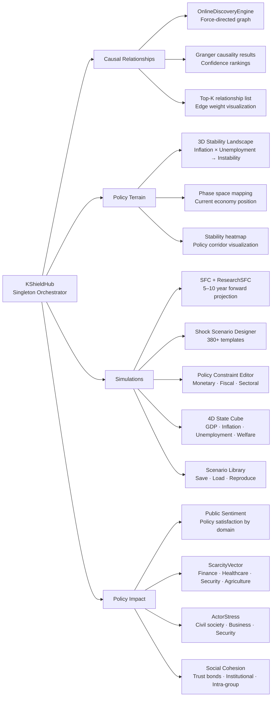
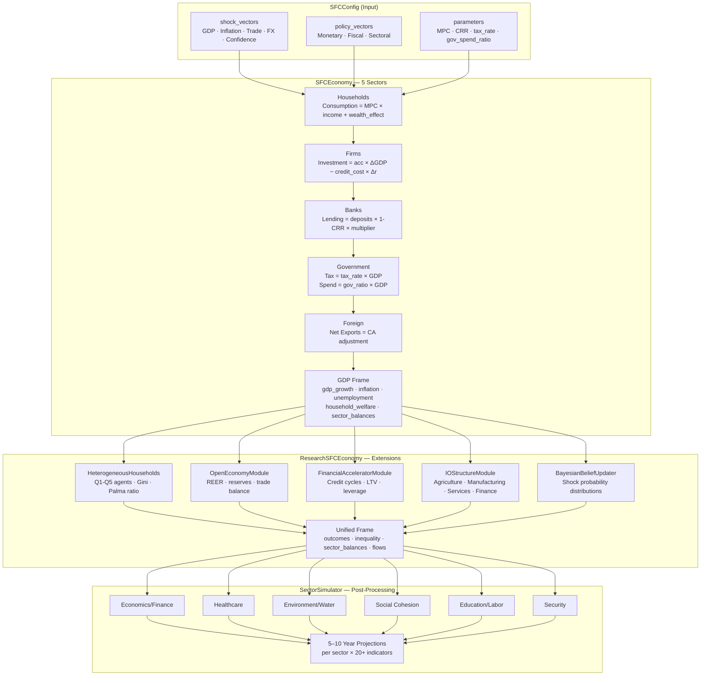
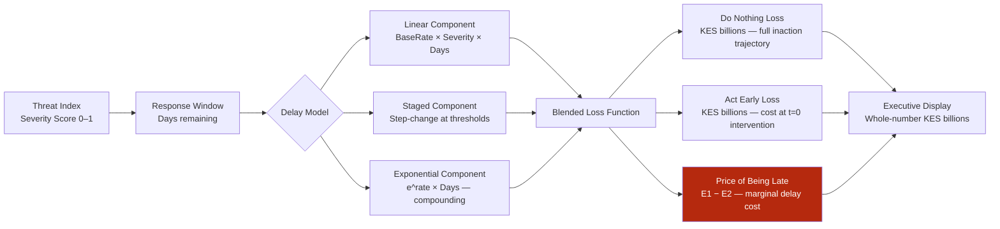
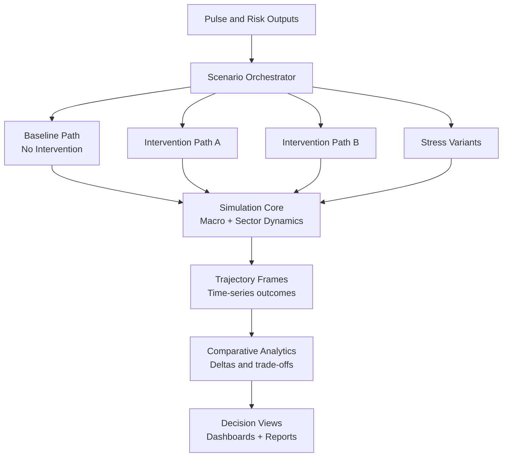
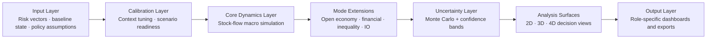
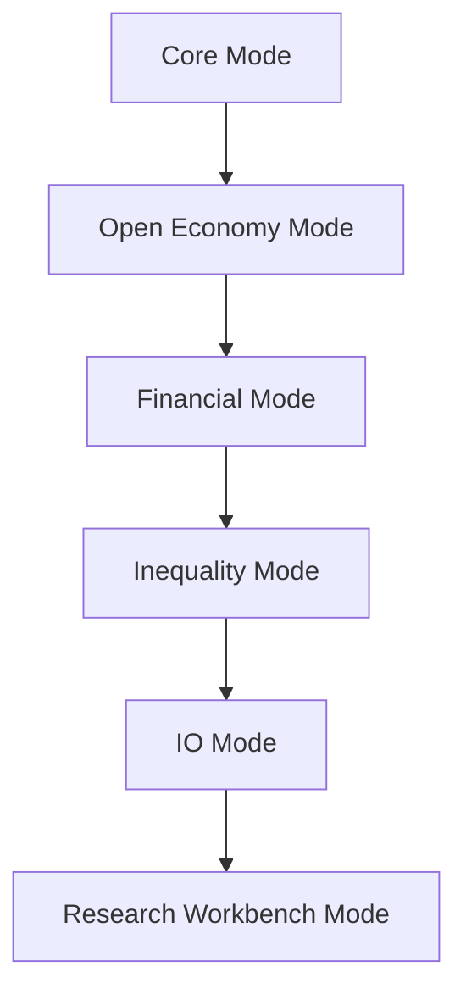
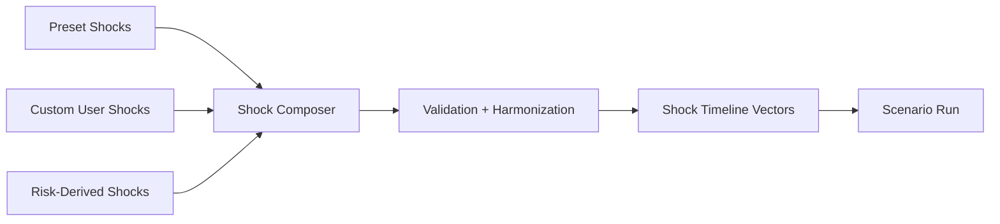
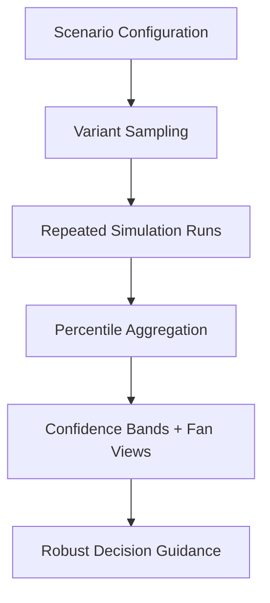
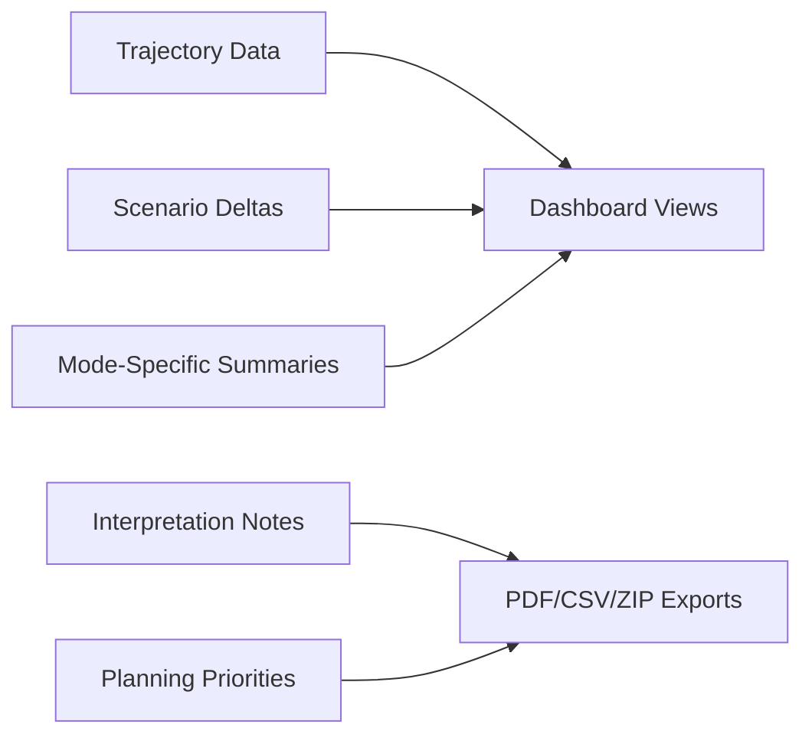

# KShield — Simulation & Impact Architecture

KShield is an agent-based economic simulation system that models Kenya's economy by representing sectors and actors as adaptive decision-making agents. 

---

## 1. K-SHIELD — Module Architecture

---

## 2. SFC Economy — Simulation Architecture

---

## 3. Cost of Delay Engine

---

## 4. Kenya Economic Baselines (KNBS / World Bank 2022)

| Sector | Indicator | Baseline |
|--------|-----------|---------|
| **Economics** | GDP Growth | 5.3% |
| **Economics** | Inflation | 7.6% |
| **Economics** | Unemployment | 5.5% |
| **Healthcare** | Capacity Utilization | 72% |
| **Healthcare** | Vaccination Coverage | 68% |
| **Healthcare** | Mortality Risk | 22% |
| **Environment** | Water Access | 62% |
| **Environment** | Drought Severity | 22% |
| **Environment** | Food Security | 68% |
| **Social** | Poverty Headcount | 36.5% |
| **Social** | Inequality (Gini-equivalent) | 38.6% |
| **Social** | Cohesion Index | 54% |
| **Education** | School Attendance | 83% |
| **Education** | Labor Productivity | 1.0 (index) |
| **Security** | Stability Index | 61% |
| **Security** | Conflict Risk | 28% |
| **Security** | Institutional Trust | 42% |

**Heterogeneous Household Calibration (Q1–Q5):**

| Quintile | Income Share | MPC | Formal Employment |
|----------|-------------|-----|------------------|
| Q1 (bottom 20%) | 4% | 0.95 | 10% |
| Q2 | 8% | 0.90 | 25% |
| Q3 | 12% | 0.85 | 45% |
| Q4 | 20% | 0.75 | 70% |
| Q5 (top 20%) | 56% | 0.60 | 90% |

---

## 5. Simulation Engine Deep Dive

This section explains how the Simulation Engine transforms risk intelligence into forward-looking scenario outcomes for decision support, including advanced modes, uncertainty systems, and multidimensional analysis views.

### 5.1 Simulation Engine Purpose

The Simulation Engine is designed to answer five policy questions:

1. What is likely to happen if no action is taken?
2. Which intervention pathway performs better under uncertainty?
3. How quickly do outcomes diverge across policy options?
4. Which sectors are most exposed over the next planning horizon?
5. What trade-offs appear across growth, inflation, employment, and social pressure?

### 5.2 End-to-End Simulation Flow

### 5.3 Layered Architecture

Layer responsibilities:

1. Input Layer standardizes assumptions, shock context, and time horizon.
2. Calibration Layer aligns scenario setup with latest contextual baselines.
3. Core Dynamics Layer computes macro trajectories over time.
4. Mode Extensions layer adds domain-specific realism.
5. Uncertainty Layer estimates plausible ranges around central paths.
6. Analysis Surfaces layer converts trajectories into comparative decision tools.
7. Output Layer publishes interpretable insights for each user role.

### 5.4 Engine Modes

The Simulation Engine supports multiple modes, each adding analytical depth:

1. Core Mode: baseline macro pathway simulation for policy comparison.
2. Open Economy Mode: trade, reserve, and currency-pressure dynamics.
3. Financial Mode: credit-cycle and banking-stability pressure analysis.
4. Inequality Mode: distribution-sensitive outcomes across population segments.
5. IO Mode: inter-sector propagation across connected production systems.
6. Research Workbench Mode: full advanced exploration combining all extensions.

### 5.5 Custom Shock System

Custom shocks allow users to model realistic disruptions with controlled timing and magnitude.

Capabilities:

1. Multi-channel targets such as demand, supply, trade, currency, and confidence.
2. Temporal controls for start period, duration, and sequence ordering.
3. Shape options including step, pulse, ramp, decay, and cyclical behavior.
4. Multi-shock stacking so complex events can be composed in one scenario.

### 5.6 Custom Policy System

The policy layer supports both template-based and custom intervention design.

Policy design dimensions:

1. Instrument type: monetary, fiscal, sectoral, emergency.
2. Intensity: low, medium, high or user-defined gradients.
3. Timing: immediate, staged, delayed, or sequenced response.
4. Composition: combine several instruments into a coordinated policy package.
5. Comparison: evaluate multiple policy mixes against baseline.

### 5.7 Scenario Orchestration

Scenarios are orchestrated as a portfolio, not isolated runs.

1. Baseline is generated first as a reference pathway.
2. Intervention scenarios are executed in parallel for comparability.
3. Stress variants are applied to test policy robustness.
4. Outputs are normalized into one comparison layer for decision review.

### 5.8 Monte Carlo and Confidence Logic

The Simulation Engine uses repeated stochastic variants to quantify uncertainty.

Uncertainty principles:

1. Show ranges, not only one deterministic line.
2. Use median pathways for central interpretation.
3. Evaluate tail ranges for contingency planning.
4. Prefer policies that remain stable across wide bands.

### 5.9 Advanced Analysis Surfaces

The engine provides many analysis surfaces for different decision questions:

1. Compare Runs: side-by-side scenario trajectory overlays.
2. Sensitivity Matrix: outcome response to parameter and policy variation.
3. Phase Explorer: state-space trajectory movement over time.
4. Impulse Response: shock propagation and recovery dynamics.
5. Stress Matrix: scenario-by-outcome pressure map.
6. Parameter Surface: multidimensional response landscape.
7. Monte Carlo Fan Views: uncertainty envelopes over horizon.
8. 3D and 4D State Views: multidimensional policy-state interpretation.

### 5.10 4D Visualization Perspective

The 4D view allows stakeholders to track multiple macro dimensions together rather than one metric at a time.

Typical 4D interpretation pattern:

1. Axis X: growth or output movement.
2. Axis Y: inflation pressure trajectory.
3. Axis Z: employment or stability path.
4. Fourth dimension: welfare, risk score, or color-encoded pressure state.

This helps teams spot stability corridors, divergence patterns, and policy turning points faster.

### 5.11 Simulation Output Contract

The Simulation Engine returns structured outputs for dashboards and reports:

1. Time-series trajectories for key indicators.
2. Scenario deltas versus baseline pathways.
3. Sector impact summaries and pressure markers.
4. Confidence-oriented interpretation notes.
5. Planning priorities suitable for executive and operational workflows.

### 5.12 Role-Based Consumption

Simulation outputs feed different roles with tailored focus:

1. Executive: strategic pathway selection and national-level trade-offs.
2. Admin: sector coordination, escalation planning, and allocation decisions.
3. Local Institution: operational priorities and monitoring checkpoints.

