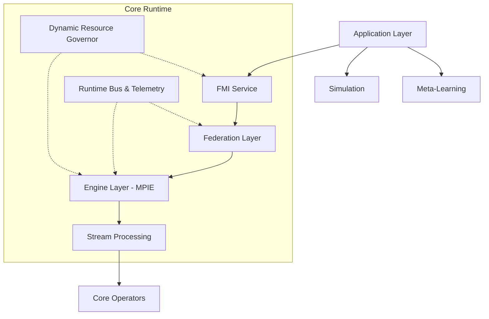
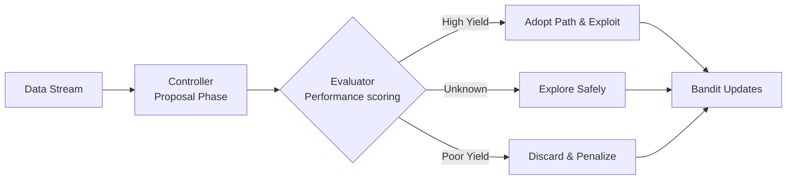

# Scarcity Framework Architecture

**Scarcity** is an online-first framework for scarcity-aware deep learning. It provides a complete runtime for adaptive, resource-efficient machine learning with real-time performance feedback and dynamic optimization.

The core library implements a sophisticated multi-layered architecture designed for:
1. **Federated Learning**: Training across distributed, private nodes.
2. **Online Inference**: Learning from streaming data in real-time.
3. **Adaptive Resource Management**: Scaling compute based on device health.

---

## 1. System Block Diagram

The Scarcity core library follows a layered architecture with strict separation of concerns.

### Component Interaction Flow:

1. **Data Ingestion**: Stream sources feed data windows to the engine via the stream processing loop.
2. **Path Exploration**: **MPIE** proposes and evaluates candidate paths using bandit algorithms (UCB/Thompson).
3. **Federation**: Successful paths are packaged into `PathPacks` and shared across domains via the Federation Coordinator.
4. **Meta-Learning**: Cross-domain patterns are learned and applied to the global model prior.
5. **Resource Management**: **DRG** monitors system resources (CPU, RAM) and throttles the Engine adaptation gracefully.
6. **Simulation**: Agent-based models provide what-if analysis capabilities to predict system behavior offline.

---

## 2. Multi-Path Inference Engine (MPIE)

The **Multi-Path Inference Engine (MPIE)** is the core component responsible for online learning and adaptive inference. It discovers optimal computation paths dynamically, and naturally adapts to available CPU/RAM in real-time.

### Processing Pipeline

1. **Proposal Phase**: The Controller analyzes the current context and proposes candidate inference pathways.
2. **Evaluation Phase**: Evaluates candidates on the incoming data window, scores their performance (Accuracy vs Latency), and computes confidence bands.
3. **Selection Phase**: Selects the best path based on Reward and Cost, avoiding local optima via diversity penalties.
4. **Update Phase**: The system updates the Bandit routing tables based on the result.

---

## 3. Bandit Routing Algorithm

The core controller uses an **Upper Confidence Bound (UCB)** formula infused with inference diversity bonuses. It simultaneously seeks accuracy while strictly penalizing heavy latency.

`UCB(arm) = μ(arm) + τ · √(2ln(T) / n(arm)) + γ · D(arm) - η · C(arm)`

**Execution Drivers**:
* **μ(arm)**: Mean reward observed so far for this algorithm path.
* **τ**: Temperature parameter to dynamically adjust exploration boldness.
* **D(arm)**: Diversity score to encourage testing unexplored inference branches.
* **C(arm)**: Execution latency cost to discard slow paths dynamically.

If a device reaches thermal throttling, the **Dynamic Resource Governor (DRG)** directly scales up the negative weight `η`, forcing the Bandit Router to immediately discard mathematically dense neural network pathways and default to simpler, lighter heuristic trees.
