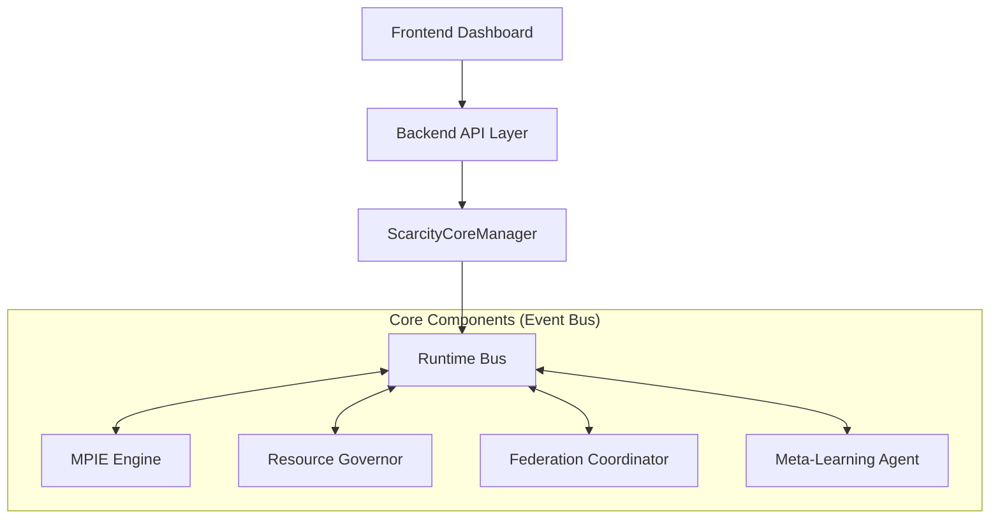

# System Architecture

SCARCITY follows a modular, event-driven architecture designed for scalability and fault tolerance.

## High-Level Design

The system is composed of three primary layers communicating via an asynchronous Runtime Bus.



*(If you cannot render Mermaid diagrams, use the ASCII diagram below)*

```text
┌────────────────────────┴────────────────────────────────────┐
│                  Backend (FastAPI)                           │
│  ┌──────────────────────────────────────────────────────┐  │
│  │         ScarcityCoreManager (Orchestration)          │  │
│  └──────────────────────────────────────────────────────┘  │
└────────────────────────┬────────────────────────────────────┘
                         │ Event Bus
┌────────────────────────┴────────────────────────────────────┐
│              Scarcity Core Components                        │
│  ┌──────────┐ ┌──────────┐ ┌──────────┐ ┌──────────┐      │
│  │ Runtime  │ │   MPIE   │ │   DRG    │ │   Meta   │      │
│  │   Bus    │ │Orchestr. │ │ Governor │ │ Learning │      │
│  └──────────┘ └──────────┘ └──────────┘ └──────────┘      │
└─────────────────────────────────────────────────────────────┘
```

## Core Design Principles

1.  **Event-Driven**: All components communicate via an async message bus, decoupling the subsystems.
2.  **Modular**: Each component (like the Federation Layer or Simulation Engine) can be enabled or disabled independently.
3.  **Observable**: The system emits comprehensive telemetry for real-time monitoring.

## Data Flow Pipeline

1.  **Ingestion**: Raw data arrives and is processed into windows by the Stream Manager.
2.  **Discovery**: The MPIE Engine analyzes windows to propose causal paths.
3.  **Regulation**: The DRG Governor monitors hardware usage and throttles the engine if limits are reached.
4.  **Federation**: If enabled, the Federation Coordinator aggregates insights from other peers.

<!-- end list -->
